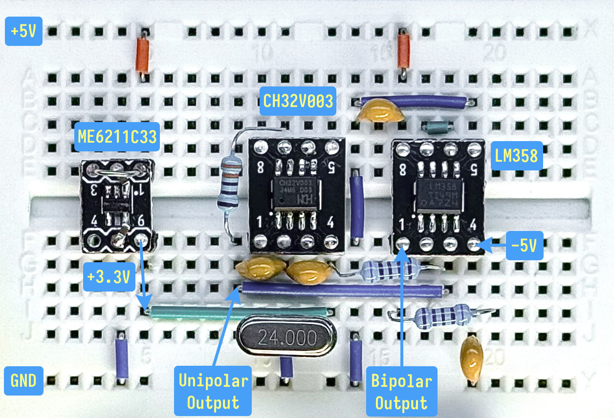
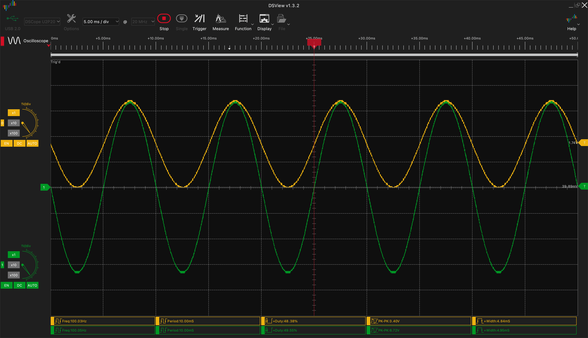
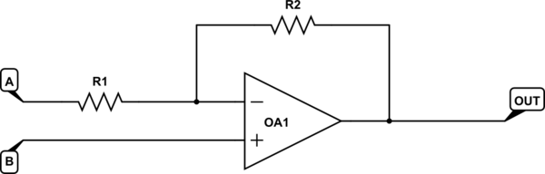

# CH32V003 Sine Wave Generator

A precision sine wave generator using PWM output from the CH32V003 RISC-V microcontroller. This implementation combines digital signal processing with analog filtering to synthesize clean sinusoidal waveforms, achieving optimal performance for frequencies below 660 Hz.

- [CH32V003 Sine Wave Generator](#ch32v003-sine-wave-generator)
  - [Schematic](#schematic)
  - [Output Waveform](#output-waveform)
  - [Technical Implementation](#technical-implementation)
    - [System Architecture](#system-architecture)
    - [PWM Signal Generation](#pwm-signal-generation)
      - [PWM Duty Cycle Calculation](#pwm-duty-cycle-calculation)
    - [Analog Signal Reconstruction](#analog-signal-reconstruction)
    - [Bipolar Sine Wave Conversion](#bipolar-sine-wave-conversion)
  - [Hardware Reference](#hardware-reference)
    - [CH32V003 - Microcontroller](#ch32v003---microcontroller)
    - [LM358 - Operational Amplifier](#lm358---operational-amplifier)
  - [References](#references)
  - [License](#license)

## Schematic

The [schematic KiCad project](./schematic/CH32V003-Sine-Wave-Generator/)

## Output Waveform

## Technical Implementation

### System Architecture

The sine wave generation system employs a three-stage approach:

1. **PWM Generation**: High-frequency carrier modulation at 200 kHz
2. **Analog Reconstruction**: RC low-pass filtering for signal reconstruction
3. **Bipolar Conversion**: Converting unipolar sine wave to bipolar sine wave and amplification

### PWM Signal Generation

The CH32V003's Timer 1 (TIM1) generates a high-frequency PWM signal at 200 kHz on pin PC4. The PWM duty cycle is continuously modulated according to pre-calculated sine wave samples to create the desired waveform envelope.

**PWM Specifications:**

- Carrier Frequency: $f_{PWM} = 200 \text{ kHz}$
- PWM Period: $T_{PWM} = \frac{1}{f_{PWM}} = 5 \text{ μs}$
- Resolution: $N_{clocks} = \frac{f_{system}}{f_{PWM}} = \frac{48 \text{ MHz}}{200 \text{ kHz}} = 240 \text{ clock cycles}$

#### PWM Duty Cycle Calculation

The sine wave is synthesized using a lookup table containing 100 pre-calculated samples. Each sample represents the corresponding PWM duty cycle value for that specific phase angle in the sine wave period.

$$\text{sample}[n] = \frac{[\sin(2\pi \cdot \frac{n}{100}) + 1] \cdot (N_{clocks} - 1)}{2}$$

**Where:**

- $n = 0, 1, 2, \ldots, 99$
- $N_{clocks} = 240$ (PWM resolution in clock cycles)
- The $+1$ offset translates the sine wave from range $[-1, 1]$ to $[0, 2]$
- Division by 2 normalizes the range to $[0, 1]$
- Multiplication by $(N_{clocks} - 1)$ scales to PWM duty cycle values $[0, 239]$

### Analog Signal Reconstruction

The high-frequency PWM signal is converted to a smooth analog sine wave using a first-order RC low-pass filter. This filter effectively removes the PWM carrier frequency while preserving the sine wave envelope.

**Filter Specifications:**

- Resistance: $R = 3.3 \text{ kΩ}$
- Capacitance: $C = 47 \text{ nF}$
- Cutoff Frequency: $$f_c = \frac{1}{2\pi RC} = \frac{1}{2\pi \times 3300 \times 47 \times 10^{-9}} \approx 1.03 \text{ kHz}$$

**Filter Performance:**

The cutoff frequency is strategically chosen to:

- Pass sine wave frequencies (typically 100-1000 Hz) with minimal attenuation
- Suppress the 200 kHz PWM carrier frequency by approximately 52 dB
- Maintain signal integrity while eliminating switching artifacts

### Bipolar Sine Wave Conversion

According to this [Stack Exchange answer](https://electronics.stackexchange.com/a/725011/306795), the unipolar sine wave is converted to a bipolar sine wave and amplified to $\pm3.3\text{ V}$.

**Quote from the answer on R1 and R2 calculation:**
> There's a relationship between $V_A$, $V_B$ and $V_{OUT}$ for the following generic circuit:
>
> 
>
> The formula is:
>
> $$ V_{OUT} = V_B\left( 1 + \frac{R_2}{R_1} \right) - V_A\frac{R_2}{R_1}$$
>
> Find two conditions that you know to be true:
>
> 1. $V_{OUT} = 0V$ when $V_B=+1.65V$
> 2. $V_{OUT} = +3.3V$ when $V_B=+3.3V$
>
> Plug those values into the formula to obtain two simultaneous equations:
>
> $$0 = +1.65\left( 1 + \frac{R_2}{R_1} \right) - V_A\frac{R_2}{R_1}$$
> $$+3.3 = +3.3\left( 1 + \frac{R_2}{R_1} \right) - V_A\frac{R_2}{R_1}$$
>
> Solve them to reveal two quantities, $V_A$ and the ratio $\frac{R_2}{R_1}$. Choose any two resistances in that ratio within reason. Keep them in the kilohms, [for these reasons](https://electronics.stackexchange.com/a/669233/292884).

## Hardware Reference

### CH32V003 - Microcontroller

- [CH32V003 Datasheet](./Documents/CH32V003%20Datasheet%20-%20V1.7.PDF)
- [CH32V003 Reference Manual](./Documents/CH32V003%20Reference%20Manual%20-%20V1.7.PDF)

### LM358 - Operational Amplifier

- [LM358](./Documents/Texas%20Instruments%20-%20LM358.pdf)
- [How to Properly Configure Unused Operational Amplifiers](./Documents/Texas%20Instruments%20-%20How%20to%20Properly%20Configure%20Unused%20Operational%20Amplifiers.pdf)

## References

- [Simple Circuit - Sinewave Generator with Arduino](https://simple-circuit.com/arduino-sinewave-generator-pwm-rc-low-pass-filter/)
- [StackExchange - Converting Unipolar Sine Wave from ESP32 to True Bipolar AC Signal (+3.3V to -3.3V) Using an Operational Amplifier](https://electronics.stackexchange.com/a/725011/306795)

## License

This work is licensed under a [Creative Commons Attribution-NonCommercial-ShareAlike 4.0 International License (CC BY-NC-SA 4.0)](https://creativecommons.org/licenses/by-nc-sa/4.0/).

**You are free to:**

- **Share** — copy and redistribute the material in any medium or format
- **Adapt** — remix, transform, and build upon the material

The licensor cannot revoke these freedoms as long as you follow the license terms.

**Under the following terms:**

- **Attribution** - You must give appropriate credit, provide a link to the license, and indicate if changes were made. You may do so in any reasonable manner, but not in any way that suggests the licensor endorses you or your use.
- **NonCommercial** - You may not use the material for commercial purposes.
- **ShareAlike** - If you remix, transform, or build upon the material, you must distribute your contributions under the same license as the original.
- **No additional restrictions** — You may not apply legal terms or technological measures that legally restrict others from doing anything the license permits.

**Notices:**

You do not have to comply with the license for elements of the material in the public domain or where your use is permitted by an applicable exception or limitation.

No warranties are given. The license may not give you all of the permissions necessary for your intended use. For example, other rights such as publicity, privacy, or moral rights may limit how you use the material.
