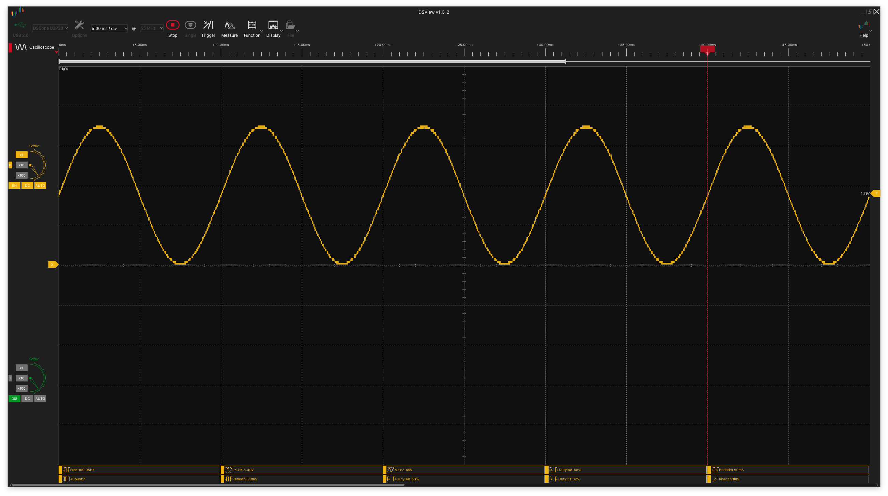
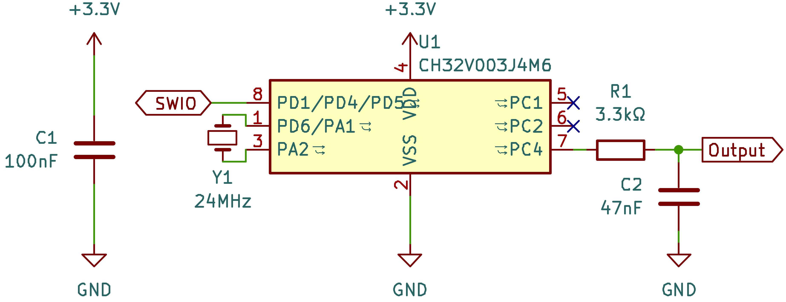
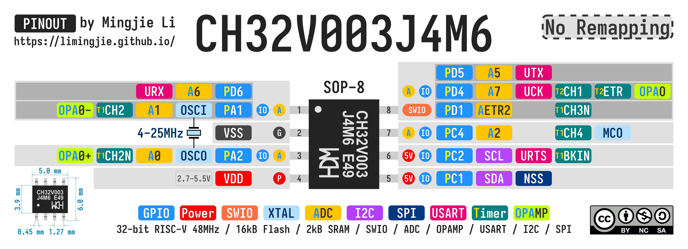

# CH32V003 Sine Wave Generator

## How the Sine Wave is Generated

This project generates sine waves using PWM (Pulse Width Modulation) output from the CH32V003 microcontroller. The sine wave generation process involves several key components working together:

### 1. PWM Signal Generation

The CH32V003's Timer 1 (TIM1) generates a high-frequency PWM signal at **200 kHz** on pin PC4. The PWM duty cycle is continuously varied to create the sine wave envelope.

**PWM Configuration:**

- PWM Frequency: $f_{PWM} = 200 \text{ kHz}$
- PWM Period: $T_{PWM} = \frac{1}{f_{PWM}} = 5 \text{ μs}$
- PWM Resolution: $N_{clocks} = \frac{f_{system}}{f_{PWM}} = \frac{48 \text{ MHz}}{200 \text{ kHz}} = 240 \text{ clocks}$

### 2. Sine Wave Sample Generation

The sine wave is approximated using a lookup table with 100 pre-calculated samples. Each sample represents the PWM duty cycle value for that point in the sine wave.

**Sample Calculation Formula:**
$$\text{sine\_table}[n] = \left\lfloor \frac{[\sin(2\pi \cdot \frac{n}{100}) + 1] \cdot (N_{clocks} - 1)}{2} \right\rfloor$$

Where:

- $n = 0, 1, 2, ..., 99$ (sample index)
- $N_{clocks} = 240$ (PWM resolution in clock cycles)
- The $+1$ offset shifts the sine wave from $[-1, 1]$ to $[0, 2]$ range
- Division by 2 scales it to $[0, 1]$ range
- Multiplication by $(N_{clocks} - 1)$ converts to PWM duty cycle values $[0, 239]$

### 3. Sample Rate and Output Frequency

The SysTick timer controls the rate at which PWM duty cycle values are updated from the lookup table.

**Timing Relationships:**

- Sample Rate: $f_{sample} = f_{output} \times N_{samples}$
- Sample Interval: $T_{sample} = \frac{1}{f_{sample}} = \frac{1}{f_{output} \times 100}$

**For 100 Hz output frequency:**

- $f_{sample} = 100 \text{ Hz} \times 100 = 10 \text{ kHz}$
- $T_{sample} = 100 \text{ μs}$

### 4. Low-Pass Filtering

The high-frequency PWM signal is converted to an analog sine wave using a simple RC low-pass filter:

**Filter Design:**

- Resistor: $R = 3.3 \text{ kΩ}$
- Capacitor: $C = 47 \text{ nF}$
- Cutoff Frequency: $f_c = \frac{1}{2\pi RC} = \frac{1}{2\pi \times 3300 \times 47 \times 10^{-9}} = 1.03 \text{ kHz}$

The cutoff frequency is chosen to:

- Allow the sine wave frequency (typically 100-1000 Hz) to pass through
- Attenuate the 200 kHz PWM carrier frequency by approximately $-52 \text{ dB}$

## License

This work is licensed under a [Creative Commons Attribution-NonCommercial-ShareAlike 4.0 International License (CC BY-NC-SA 4.0)](https://creativecommons.org/licenses/by-nc-sa/4.0/).

**You are free to:**

- **Share** — copy and redistribute the material in any medium or format
- **Adapt** — remix, transform, and build upon the material

The licensor cannot revoke these freedoms as long as you follow the license terms.

**Under the following terms:**

- **Attribution** - You must give appropriate credit, provide a link to the license, and indicate if changes were made. You may do so in any reasonable manner, but not in any way that suggests the licensor endorses you or your use.
- **NonCommercial** - You may not use the material for commercial purposes.
- **ShareAlike** - If you remix, transform, or build upon the material, you must distribute your contributions under the same license as the original.
- **No additional restrictions** — You may not apply legal terms or technological measures that legally restrict others from doing anything the license permits.

**Notices:**

You do not have to comply with the license for elements of the material in the public domain or where your use is permitted by an applicable exception or limitation.

No warranties are given. The license may not give you all of the permissions necessary for your intended use. For example, other rights such as publicity, privacy, or moral rights may limit how you use the material.
